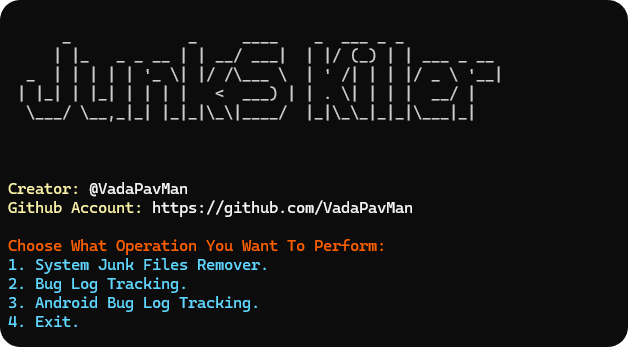
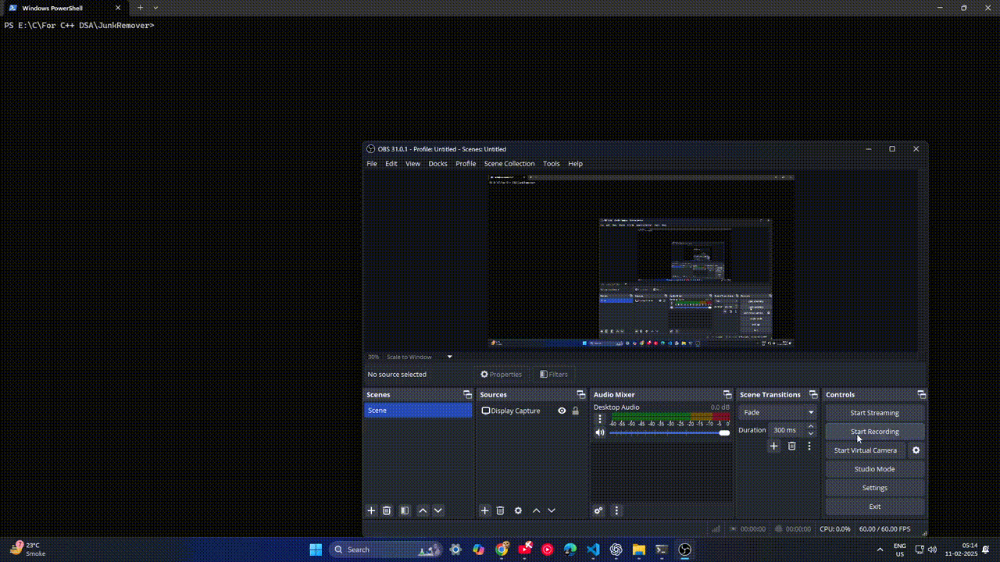

### System Junk Files Remover  

---




### **Description**  

**For Now: Run It As Administrator In Terminal.**

**If Some Folder Are Not Present In Your Device, It Will Throw A Folder Not Found Error. No Need To Worry, Other Junk Files Which Are Present, Will Be Deleted For Improving System Performance And Stablity.**

This project is a terminal-based utility for Windows that helps users quickly and efficiently delete temporary files (`Temp` and `%Temp%` folders) to improve system performance. By clearing unnecessary files from these locations, the program helps free up disk space and enhances the overall speed and responsiveness of the system. It also provides options for additional operations such as log tracking for bug resolution.

The program is designed to minimize user effort by automating the deletion process and offers an intuitive menu-based interface for selecting operations.

---

### **Features**  
- **System Junk Files Remover**: Clears temporary files from `Temp` and `%Temp%` folders to free up disk space and improve system performance.  
- **Bug Log Tracking**: Placeholder for analyzing system logs.  
- **Android Bug Log Tracking**: Placeholder for handling bug reports from Android development.  
- Clean, user-friendly ASCII art interface for a better terminal experience.  
- Built with modular coding practices using `file.cpp` and `file.hpp`.  

---

### **How to Use**  
1. **Download the Repository**:
   - Clone the repository:
     ```bash
     git clone https://github.com/VadaPavMan/System-Junk-Files-Remover.git
     cd System-Junk-Files-Remover
     ```

2. **Build the Project**:
   - Open a terminal and compile the code:
     ```bash
     g++ -std=c++17 -o JunkRemover src.cpp file.cpp
     ```

3. **Run the Program**:
   - Execute the compiled binary:
     ```bash
     ./JunkRemover
     ```

4. **Follow the On-Screen Menu**:
   - Select an option by entering the corresponding number:
     - `1`: Remove system junk files.
     - `2`: Bug log tracking (future implementation).
     - `3`: Android bug log tracking.
     - `4`: Exit the program.

---

### **Code Structure**  
- **`main.cpp`**: Contains the main logic and user interface.  
- **`file.hpp` & `file.cpp`**: Implements the `file_deletion()` function for clearing specified directories.  

---

### **Benefits**  
- **Performance Boost**: Removing temporary files frees up valuable disk space and reduces system clutter, resulting in faster and more efficient performance.  
- **User Convenience**: Provides a one-click solution to tedious manual cleaning tasks.  

---

### **Prerequisites**  
- **C++17 or higher**: Required for `std::filesystem`.  
- **Windows OS**: Designed for Windows-specific directories.  

---

### **License**  
This project is open-source and available under the MIT License. Feel free to contribute or modify it as per your needs.

